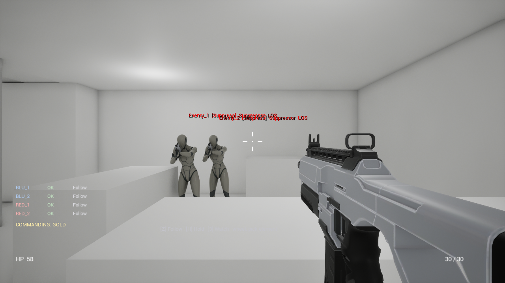

# ProjectTF — CQB mechanics sample

A close-quarters tactical FPS slice built on Unreal Engine 5.8, written in C++.

**One line: the suspects and the player's squad run the same state machine, and only their side
differs.** An ally is not a subclass of an enemy — both are thin subclasses of a shared pawn, and
the ally controller inherits the whole combat brain and adds five orders on top of it.

There is no Behavior Tree anywhere in this project. The state machine is hand-written, every
transition is visible in code, and every one of them is traceable in the log.



*Taken from the packaged build. The text over each suspect is live AI state: name, current state,
squad role, and whether it currently has line of sight.*

> Korean: [README.ko.md](README.ko.md)

---

## Running it

Unzip and run `Windows\ProjectTF.exe`. No install, no launcher, no dependencies.

The level opens in a spawn room. Walk down the corridor into room A, and room B beyond the door is
held by three suspects.

### Controls

| | |
|---|---|
| **WASD** / **Mouse** | Move, look |
| **Space** | Jump |
| **Left mouse** | Fire (hold — the rifle is automatic) |
| **Right mouse** | Aim down sights |
| **R** | Reload |
| **Q** / **E** | Lean left / right (hold) |

### Commanding the squad

Four squad members spawn behind you, split into two elements: **RED** (red uniforms) and **BLUE**
(blue). The roster at bottom-left shows each member's condition and current order.

| | |
|---|---|
| **Z** | Follow — fall in behind me |
| **H** | Hold — stop here and cover |
| **3** | Watch — keep eyes on the point under the crosshair |
| **Mouse wheel** | Cycle which element the next order goes to: RED → BLUE → GOLD (everyone) |
| **F** | Shout at the suspect under the crosshair to surrender |

**Aim at a doorway** and it outlines itself in orange, with a marker on each side showing where the
squad would stack and a line to the point inside the room. While one is highlighted:

| | |
|---|---|
| **1** | Stack — take up position either side of the door |
| **2** | Clear — go through and sweep the room |

### What to try, in about three minutes

1. Walk into room A and look at the door to room B. It highlights, and the hint at the bottom of
   the screen names it.
2. **1** to stack the squad on it, then **2** to send them through. Watch the state text over each
   figure: an ally that spots a suspect drops into the inherited combat states and then picks its
   order back up when the shooting stops.
3. Let the suspects see you. The first one into the fight suppresses, the second flanks — and the
   flanker takes the side corridor and comes into the room behind you, which is what that corridor
   exists for.
4. Wound a suspect, get close, and press **F**. Compliance is a sum of how badly hurt they are, how
   close the shout is, whether anyone on their side is still standing, and whether they can see you.
   **A healthy suspect will refuse**, and that is the point of the system rather than a bug.
5. A suspect who gives up drops the weapon, kneels, and stops being a target for the AI on both
   sides — your squad will not shoot someone with their hands up.

---

## Where to look in the code

Everything is in `Source/ProjectTF/CQB/`. Three files from the First Person template were modified;
`Variant_Shooter` and `Variant_Horror` are untouched and can be verified with `git diff`.

**[CODE_GUIDE.en.md](CODE_GUIDE.en.md)** is the reading guide — a suggested order, what to look at
in each file, the traps that cost me days, and the verification commands. If you only have an hour,
the first five sections of it are the ones worth reading.

```
                    ┌──────────────────────────┐
                    │  AEnemyAIController      │  perception + combat states
                    │  Idle/Investigate/Engage │  (Faction = Enemy)
                    │  Cover/Flank/Suppress    │
                    └───────────┬──────────────┘
                                │ inherits
                    ┌───────────▼──────────────┐
                    │  AAllyAIController       │  + Follow/Hold/Stack/Clear/Watch
                    │                          │  (Faction = Ally)
                    └──────────────────────────┘

   ACQBCharacter ───┬── UHealthComponent           shared with the player
  (Faction=Neutral) ├── UWeaponComponent           shared with the player
        ▲           └── UWeaponVisualComponent
        │
        ├── AEnemyCharacter   Faction = Enemy,  AIController = AEnemyAIController
        └── AAllyCharacter    Faction = Ally,   AIController = AAllyAIController
```

`AAllyAIController` is 395 lines and **not one of them is combat code**. Shooting, taking cover,
suppressing, flanking — all of it is the enemy controller's, inherited. What the ally adds is a
different faction, skipping registration with the enemy squad manager, and five orders.

| Concern | Where |
|---|---|
| Firing pipeline, damage, recoil, noise | `WeaponComponent.cpp` — `Fire()` is most of it |
| The state machine itself | `EnemyAIController.cpp` — senses in, state out |
| The states | `EnemyAIController_States.cpp` — one Enter/Update/Exit trio each |
| Squad roles, callouts, surrender arithmetic | `EnemyAIController_Squad.cpp` |
| Orders | `AllyAIController.cpp` |
| Role handout and flank positions | `SquadManager.cpp` |

---

## Verification

The sample can be driven from the command line with no keyboard, which is how the AI behaviour was
checked rather than eyeballed. All the hooks live in one actor (`ACQBDebugDirector`) and none of it
is in the gameplay classes; with no arguments it does nothing.

```bash
# engagement, role handout, flank, a death and the reassignment
ProjectTF.exe -game -nullrhi -unattended -stdout -CQBPlayerAt=200,80,120 -CQBKillEnemyAfter=8

# squad orders
ProjectTF.exe ... -CQBOrder=stack -CQBOrderAfter=5 -CQBOrderDoor=1
ProjectTF.exe ... -CQBOrder=clear -CQBOrderAfter=5 -CQBOrderDoor=1

# the compliance curve, varying only the wound
ProjectTF.exe ... -CQBPlayerAt=200,80,120 -CQBKillEnemyAfter=3 -CQBKillCount=3 \
  -CQBKillDamage=0.7 -CQBOrderAfter=6 -CQBOrder=challenge
```

Every line beginning `CQB` in the log traces the AI. A sample run:

```
[Enemy_1] Contact!                     sight acquired, relayed to the squad
Enemy_2, Enemy_3  Idle -> Investigate  heard the callout, moving
Enemy_1  Engage -> Cover -> Suppress   first into the fight = Suppressor
Enemy_2  Engage -> Flank               second = Flanker
[Enemy_2] Flanking left!
Enemy_2  Flank -> Engage               arrived behind the player
```

Compliance, measured from the same spot with only the wound changed:

```
full health   →  0.67 / 1.00   refused
30 % health   →  1.13 / 1.00   surrendered
15 % health   →  1.38 / 1.00   surrendered
```

The decimals move a little between runs, because the distance term depends on exactly where the
suspect is standing when the shout lands. The outcomes do not.

---

## Scope, honestly

This is a mechanics sample, not a vertical slice.

**What is real:** the AI, the squad command layer, the surrender system, the weapon pipeline, the
faction model, and the level built around a flanking route so the flank state has somewhere to go.
All of it is C++ and all of it is verified rather than asserted.

**What is placeholder:** the level is greybox. There is no audio at all. Firing, being hit and
surrendering are expressed by moving the capsule and hiding the weapon rather than by dedicated
animation — the logic is right, only what you see is temporary. The AI state text on screen is
debug drawing, which is why the build ships as Development.

**What is deliberately not open yet:** there are no `BlueprintImplementableEvent` hooks, so there is
nowhere to hang sound or a muzzle flash from Blueprint yet, and the AI tuning properties need a
Blueprint shell made once before the inspector will show them. Both are short jobs; they were left
out because nothing in this sample needed them, and `CODE_GUIDE.en.md` says where they would go.

---

## Building from source

Requires **Unreal Engine 5.8**.

```bash
# editor target
Build.bat ProjectTFEditor Win64 Development -Project="...\ProjectTF.uproject"

# package (Development on purpose - Shipping compiles out the AI state text)
RunUAT.bat BuildCookRun -project="...\ProjectTF.uproject" -noP4 -platform=Win64 \
  -clientconfig=Development -cook -build -stage -pak -compressed -archive \
  -archivedirectory="...\Packaged" -nodebuginfo
```

The level is generated by `Scripts/BuildCQBLevel.py` rather than hand-placed, so the layout is
reproducible and reviewable as code. It ships with no baked navigation data — a commandlet holds
the navigation build lock and cannot produce any — so `ACQBSpawner` asks for a runtime build on the
first BeginPlay and the AI retries move orders until the tiles arrive.
